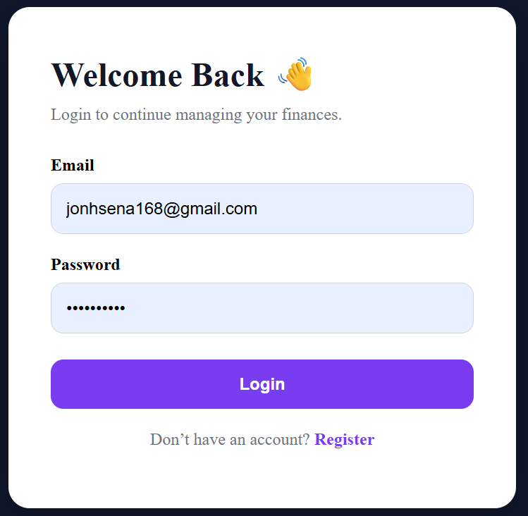
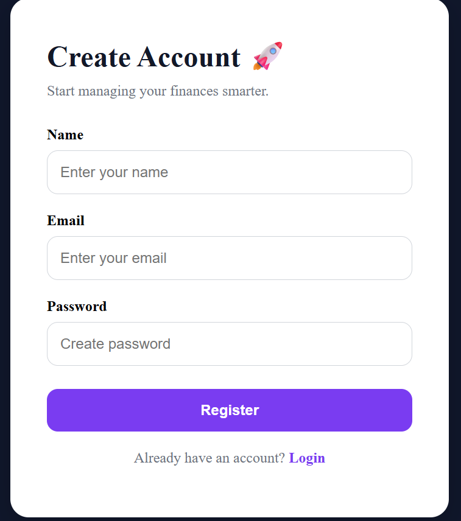
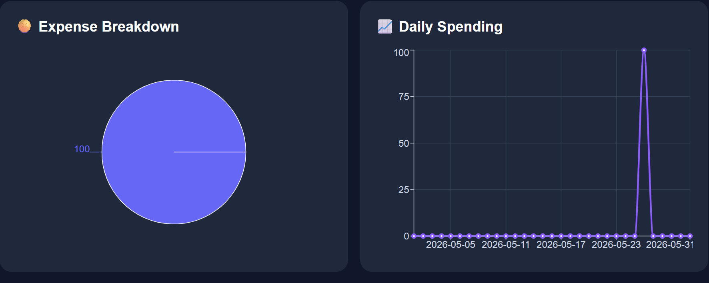
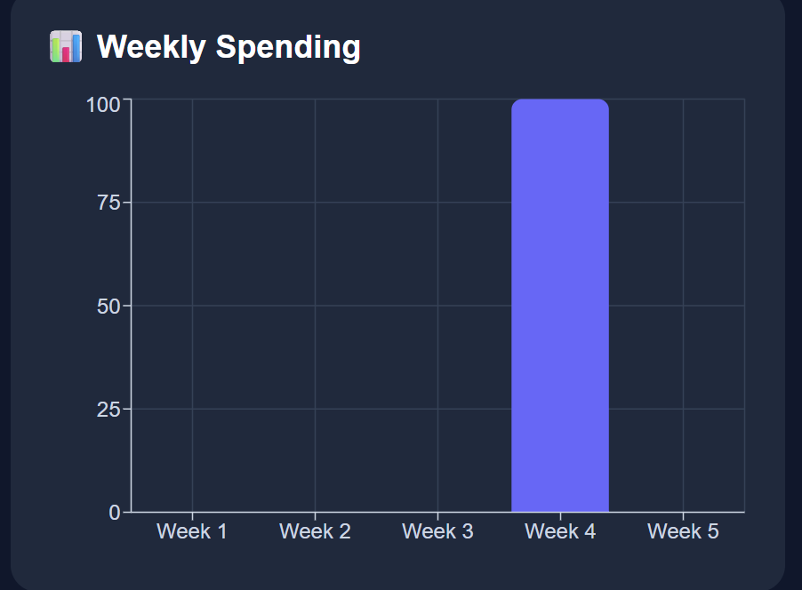
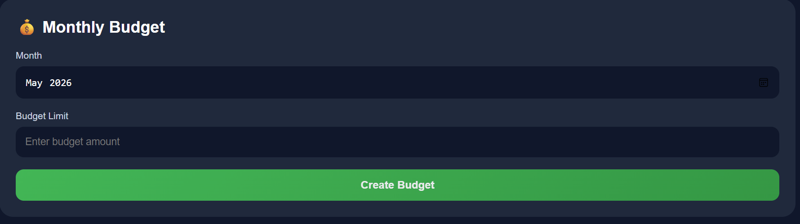
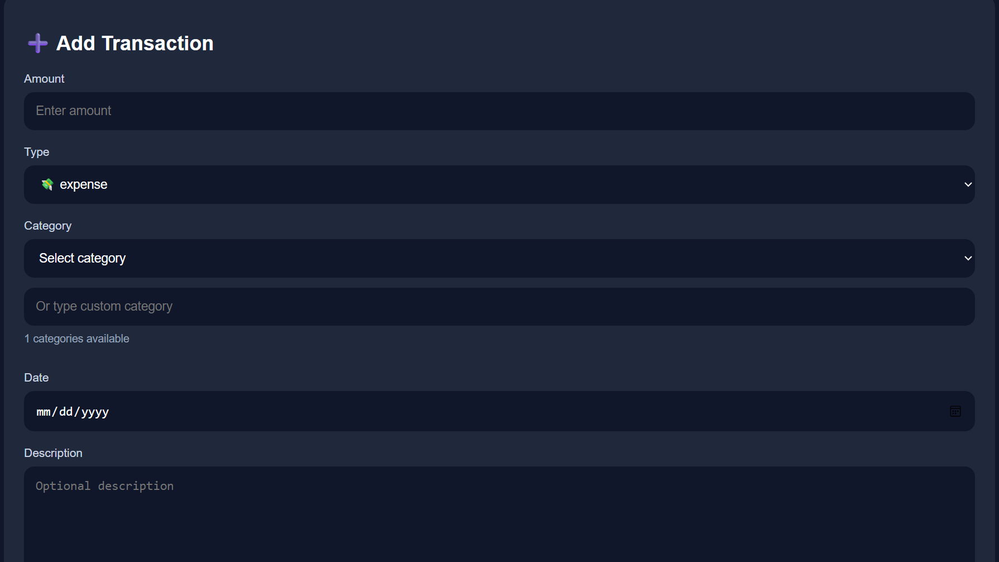
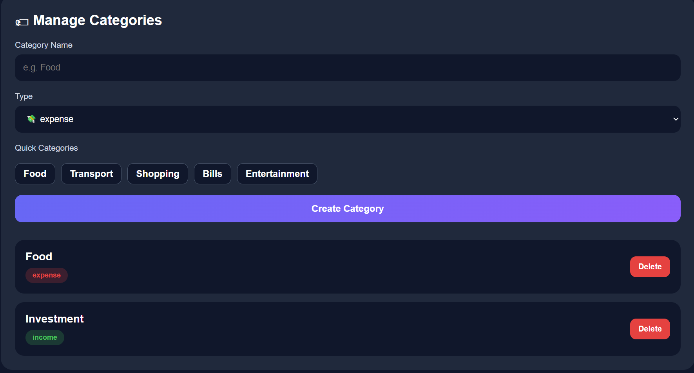

# Fintech Dashboard System

## Project Description

The Fintech Dashboard System is a full-stack web application developed to help users manage and monitor personal finances digitally.

Users can:
- add income and expenses,
- manage categories,
- create monthly budgets,
- and analyze spending through charts and dashboard analytics.

This project was built using:
- Laravel API
- React + TypeScript
- SQL Server
- Laravel Sanctum Authentication

---

# Features

## Authentication
- User Registration
- User Login
- Protected Routes

## Transactions
- Add Transactions
- Delete Transactions
- Income & Expense Tracking

## Categories
- Create Categories
- Dynamic Category Filtering

## Budget Management
- Monthly Budget Tracking
- Budget Warning System

## Dashboard Analytics
- Financial Summary
- Weekly Spending Charts
- Category Breakdown
- AI Recommendations

---

# Technologies Used

## Backend
- Laravel
- Sanctum
- SQL Server

## Frontend
- React
- TypeScript
- Axios
- Recharts

---

# Project Structure

```txt
fintech-dashboard/
│
├── backend/
├── frontend/
├── .gitignore
└── README.md
```

---

# Installation Guide

## Backend Setup

```bash
cd backend

composer install

cp .env.example .env

php artisan key:generate

php artisan migrate

php artisan serve
```

Backend runs on:

```txt
http://127.0.0.1:8000
```

---

## Frontend Setup

```bash
cd frontend

npm install

npm run dev
```

Frontend runs on:

```txt
http://localhost:5173
```

---

# API Authentication

This project uses Laravel Sanctum authentication.

Login returns a Bearer Token used for protected API requests.

---

# Sample Test Account

```txt
Email: john@example.com
Password: password123
```

---

# Screenshots

## Login Page



---

## Register Page



---

## Chart




---

## Budget



---

## Transactions



## Category


---

# Author

Name: Tham Ravy
Project: Fintech Dashboard System